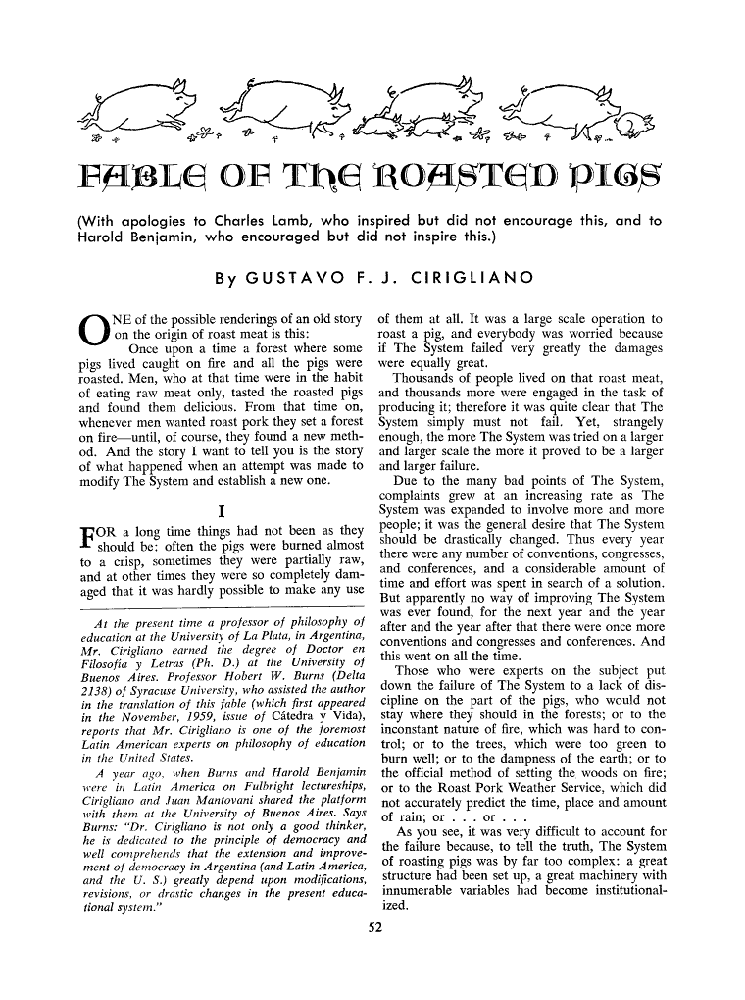
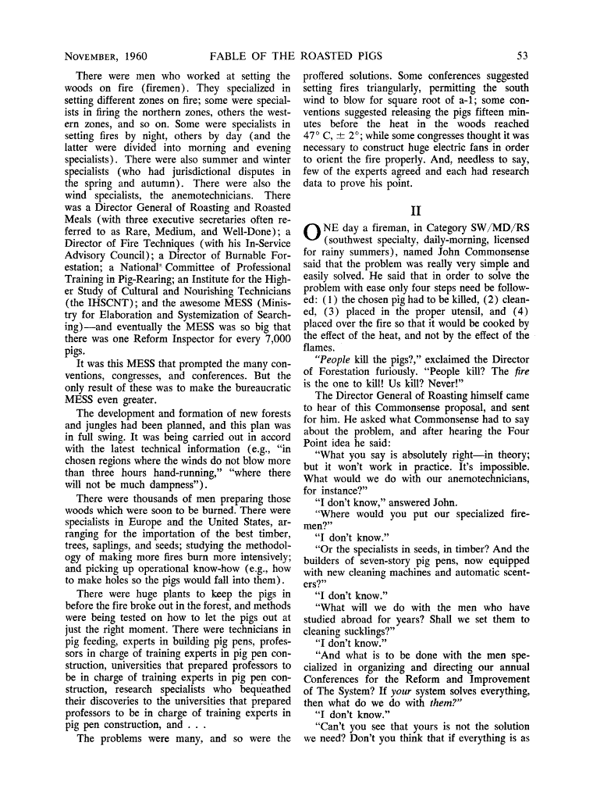
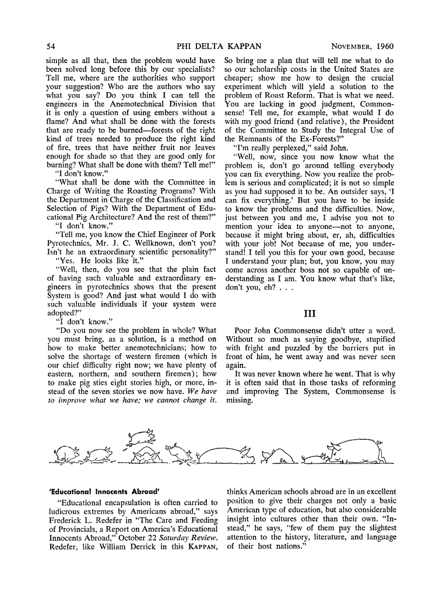

# Original English publication scans

These are the three scanned pages used as the source of truth for the English transcription in this repository.

**Author:** Gustavo F. J. Cirigliano  
**Title:** “Fable of the Roasted Pigs”  
**Publication:** *The Phi Delta Kappan*, vol. 42, no. 2, November 1960, pp. 52–54.

A note printed on page 52 states that the fable first appeared in the November 1959 issue of *Cátedra y Vida* and that Professor Robert W. Burns of Syracuse University assisted the author with the English translation.

- [Back to the English transcription](../README.md)
- [Português (Brasil)](../A_Fábula_dos_Porcos_Assados.md)

## Page 52

## Page 53

## Page 54

The images are preserved without modification from the versions previously stored at the repository root.